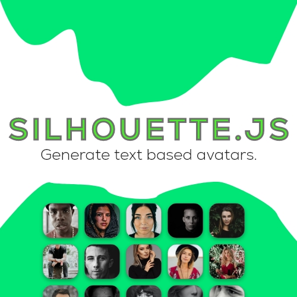

# 🧑 silhouette

[](https://app.netlify.com/sites/silhouette-example/deploys)
[](https://img.shields.io/npm/v/silhouettejs)


<p align="center">
  
</p>

Silhouette is a **small, dead-simple** JS library built to help you text-based avatars without loading other heavy libraries like gravatar. Here's an example of how your avatars might look: https://silhouette-example.netlify.app/.

## 🍭 Installation
Simply download the files from the ``dist`` folder or install the npm version by doing ``npm install silhouettejs`` or ``yarn add silhouette``.

You can now use it by ``require()`` or ``import()`` either ways.

### Usage
It's really "dead-simple", just call a function and that's it.

- To call the function:
 ```js
// Load the module
import { generateAvatar } from 'silhouettejs';

// You can pass your own data from fetch() requests as well.
const names = ["Tom Clancy", "Robin Hood", "William Henry"];

// Store avatar urls in array
const avatars = []

// Loop through the names and call generateAvatar() to generate the avatar. 
names.forEach(name => {
    // Push the newly generate avatar to the avatars array.
    avatars.push(generateAvatar(name));
})
```
***Note that this generates avatars with random colors, to specify your own background color, you can override the default options by passing an optional object.***

```js
...
generateAvatar(someName, {backgroundColor: '#customHexColor'})
```

You can then directly use the returned *svg* url in an ```` tag like:

```html


<script>
    import { generateAvatar } from 'silhouettejs';
    const avatarElement = document.getElementById('avatar');
    avatarElement.src = generateAvatar("Some Name");
</script>

```
A more ideal application would be to use this in existing frameworks that support literals. A similar example for React would look something like:

```jsx
<User name={user.name} picture={generateAvatar(user.name)}>
```
### Rounded Avatar
By default silhouette returns a square shaped avatar however you can change it to a rounded avatar as well by explicitly passing ``rounded: true`` in the options object like below.

```js
import { generateAvatar } from 'silhouettejs';

// Run the function to generate the avatar.
generateAvatar('Some name', {rounded: true})
```
This would return a rounded avatar instead.

### Extending on the CSS
You can resize the avatar flexibly with CSS since this is an SVG image.

## Todo
- [ ] Add multiple fonts support.
- [ ] Add a background color range for selected randomized colors.

## Credits
- Thanks to @Hydrophobefireman for his weirdass but epic [framework](https://github.com/hydrophobefireman/ui-lib).
- Thanks to @Protart for his epic SVG.
